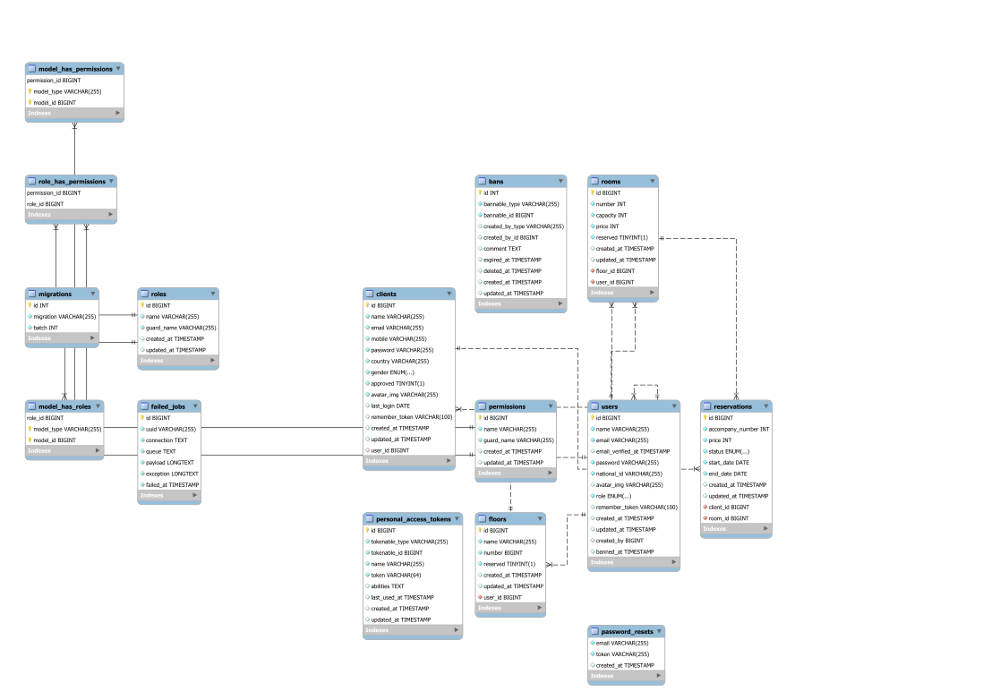
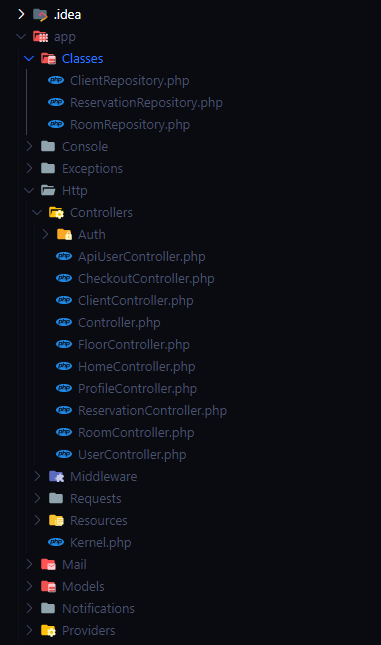

# SeaScape &middot; 
 This is our implementation for the hotel management system project done using laravel, The system is submitted as the final project for the Laravel course offered by the information technology institute (ITI).

# Table of Contents  
- ### [Introduction](#Introduction) :microphone:	
- ### [Getting Started](#Getting-Started) :memo:
- ### [Database Design](#Database-Design) :floppy_disk:
- ### [System Dependencies](#System-Dependencies) :minidisc:
- ### [Users in System](#Users) :family:
  - ### [Staff](#Staff) :construction_worker:
    - ### [Admins](#Admins) :smiling_imp:
    - ### [Managers](#Managers) :cop:
    - ### [Receptionist](#Receptionist) :information_desk_person:
    - ### [Clients](#Clients) :heart_eyes:
- ### [Configurations](#Configurations) :computer: 
  - ### [Mail](#Mail) :email:
  - ### [Database](#Database) :cd:
- ### [Design Patterns](#Design-Patterns) :recycle: 
- ### [Authors](#Authors) :thinking:
- ### [License](#License) :closed_book:


# Introduction

The system is a hotel management system that helps different hotel managers to manage their hotels, Our implementation starts by adding two different login panels for staff and clients each have their own interfaces of Adminlte template with their options using roles and Authentications.


# Getting Started
Before we jump into working with the system we first have to setup some stuff and commands.

As we are not only using Authentications on the default **Users** model of laravel but also on another model so we created our own commands to work with it.

We also added some changes into Adminlte files, routes, styles, to perform what is expected with our business needs.

First after cloning the repository you need to run 

```
1- $composer install 
```

This command will setup all the dependencies required in the project to work. Note that it might take some time 

<br>
After that you should run

```
2- $php artisan Inject 
```

This is our custom command we use it to modify the vendor files in order to satisfy our business needs in using more models allowing a model other than user to reset password and such.

<br>

Next we start by migrating our database
```
3- $php artisan migrate:fresh
```
This command allows the migrations in the migrations folder to take place in the database specified by the config file. We'll discuss the config file later

<br>

Almost done now we must run this command
```
4- $php artisan db:seed --class=CreateRolesSeeder
```
This command assigns the roles to the users of the system (Receptionist, Manager, Admin) In order to correctly manipulate the views and middleware

<br>

Lastly you can run this command to directly inject an admin into the database with the credentials needed
```
5- $php artisan create:admin <name> <email> <password> [<nationalID>]
```
Replace the fields set between <> with the appropriate parameters, Note that the nationalID parameter is optional and you can run the command without it

<br>

Additionally if you want to create another admin with default parameters you may run this command

```
6- $php artisan db:seed --class=CreateAdminSeeder
```
This command creates an admin in the database and their credentials are: 

name = admin / email = admin@admin.com / password = 123456

inorder to run the scheduler tasks you should run this command
````
7- $ php artisan schedule:work
````
this command will allow you to run delete pending reservation task every minute
in addition to sending a notify emails to the clients which havent visited our site for a month to check on them

# Database Design
Our ER diagram is as follows:


To check the Image in full size click [here](./ER.png)

Our database consists of two authenticatable users in the system one being the Users which are the staff and the other being the Clients which are the system users.

We have a table for reservations where all client's reservations reside this allows admins to track the reservation status, durations, price and more info

Rooms and Floors are self explanatory they are added admins and managers and they have referential constraints on them 

# System Dependencies

We used some of the provided features by laravel which include but not limited to:

1- **Adminlte** which works as the base template for our project you can learn more about it from [here](https://adminlte.io/)

2- **Datatable** which is the bread and butter for information viewing for all the system and it has two implementations of the [Front](https://datatables.net/) and [Back](https://github.com/yajra/laravel-datatables) sides

3- **Spatie** which applies roles and permissions throughout the system you can check it out from [here](https://github.com/spatie/laravel-permission)

4- **Laravel Ban** which has helpful functions to restrict access to the system by modifying the migrations and adding its own migration you can check it out from [here](https://github.com/cybercog/laravel-ban)

5- **Sanctum** which provides API authentication to respond to mobile devices you can learn more about it from [here](https://laravel.com/docs/master/sanctum)

6- **Stripe** the famous online payment gateway used by the majority of sites it offers a straight forward way of implementing the payment in the system you can check it out from [here](https://stripe.com/docs/quickstart)

7- **Rinvex** Which offers methods to list countries of origins check it out from [here](https://github.com/rinvex/country)

8- **Mail** We implemented the mail system using the [Notifications](https://laravel.com/docs/8.x/notifications#introduction) we allowed a dummy gmail account to be used by non trusted applications the configurations are explained in configurations section

Note: about sanctum you can find the link to our postman collection [here](https://www.postman.com/collections/1362292092e3ef1b4d6a) you can import the link in the application and run the API calls


# Users
As we listed before our system consists of two main users categories which are:

## Staff
The staff are the ones where roles and permissions apply on they are (admins, managers, receptionists) each have their own roles and permissions which are:

### &nbsp;&nbsp; Admins
  - Create Staff users
  - Ban/Unban Receptionists
  - perform CRUD (Create, Retrieve, Update, Delete ) Operations on Floors and Rooms
  - Approve/Delete Clients
  - View Approved Clients
  - View Client's reservations

### &nbsp;&nbsp; Managers
  - Create Receptionists
  - Ban/Unban Receptionists
  - perform CRUD (Create, Retrieve, Update, Delete ) Operations on Floors and Rooms
  - Approve/Delete Clients
  - View Approved Clients
  - View Client's reservations

### &nbsp;&nbsp; Receptionist
  - Approve/Delete Clients
  - View Approved Clients
  - View Client's reservations

## Clients
  - Make reservations
  - View Their Reservations
  - Pay for reservations online

# Configurations
In the .env file we have some configurations which are as follows

## &nbsp; Mail
```
MAIL_MAILER=smtp
MAIL_HOST=smtp.gmail.com
MAIL_PORT=587
MAIL_USERNAME=<example@gmail.com>
MAIL_PASSWORD=<example password>
MAIL_ENCRYPTION=tls
MAIL_FROM_ADDRESS=<Email address>
MAIL_FROM_NAME=<Name>
```
Replace each parameter in the <> with the appropriate configurations to run the mailing system **Don't forget to allow the emails from the domain server**

<br>

## &nbsp; Database
```
DB_CONNECTION=mysql
DB_HOST=127.0.0.1
DB_PORT=3306
DB_DATABASE=hotel_management_system
DB_USERNAME=root
DB_PASSWORD=<Password>
```
By default this database configuration is supplied you can override it if the database is hosted in another server


# Design Patterns

We implemented the Repository design pattern in our project where we separated the ORM logic from the controller so the database communication is done through methods in app/classes



We didn't fully isolate it yet but we are working on it 

# Authors


<a href="https://github.com/aliosman21"></a>
<a href="https://github.com/mmAbdelhay"></a>
<a href="https://github.com/karim-arafa"></a>
<a href="https://github.com/youssefshaban"></a>
<a href="https://github.com/ibrahimHesham"></a>
<a href="https://github.com/ali-khaled-ali"></a>


# License 
SeaScape is [MIT licensed](./LICENSE).

